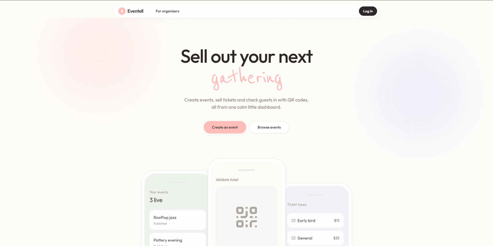
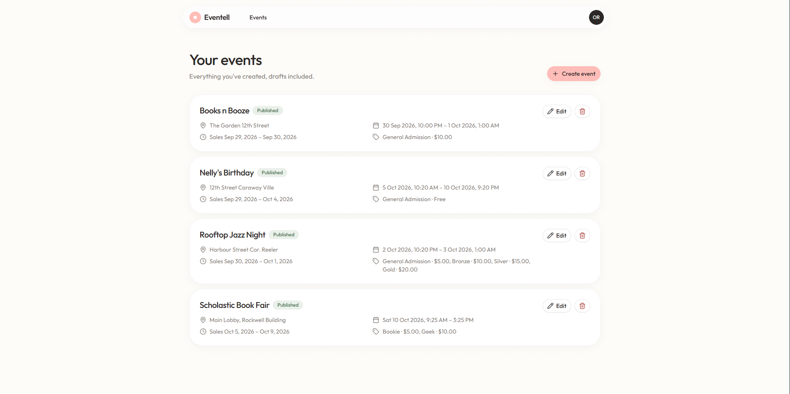
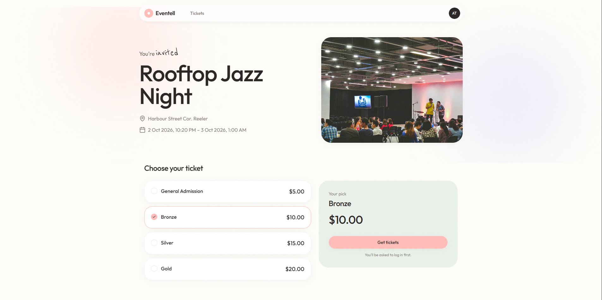
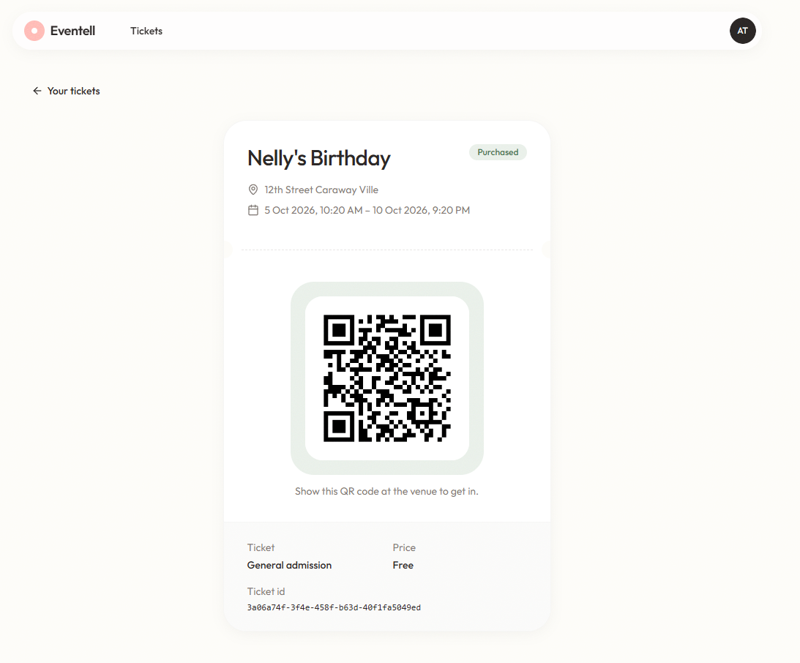
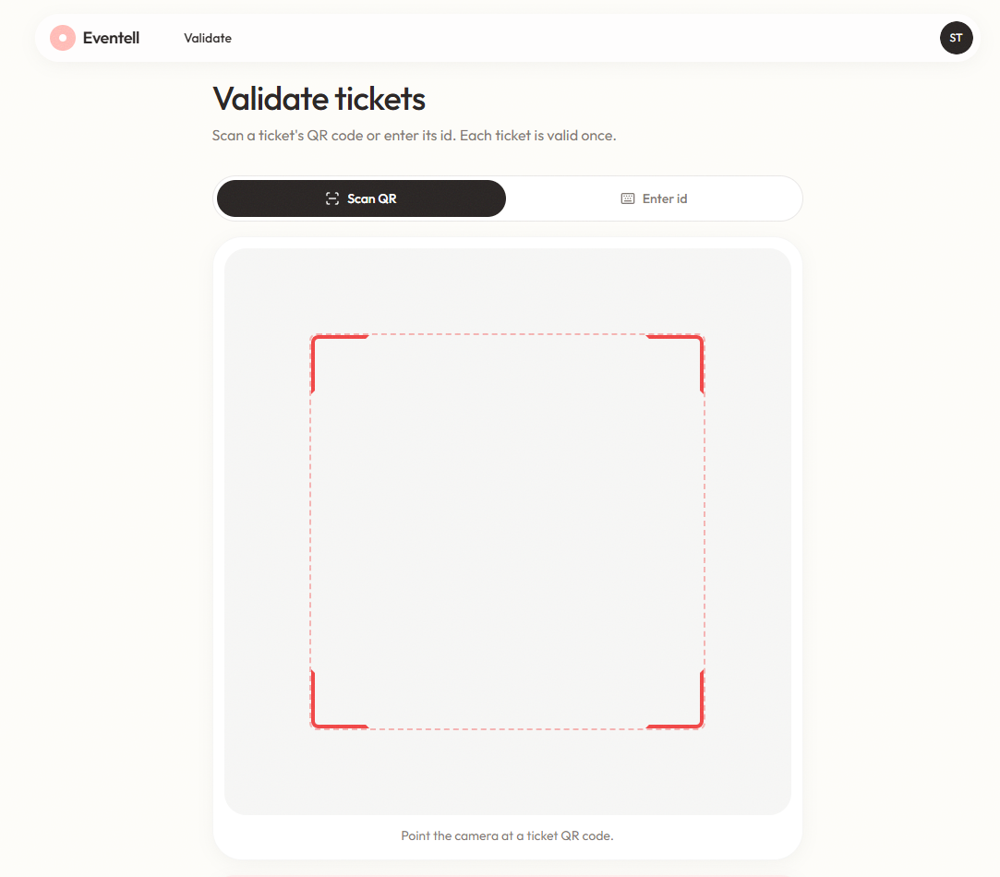

# Eventell

Eventell is an event ticketing platform. Organizers create events and sell ticket types, attendees browse events and buy tickets that come with a QR code, and staff scan those codes at the door to check guests in. Sign-in and roles are handled by Keycloak, so each role (organizer, attendee, staff) sees its own dashboard.

## Features

### Browse and search events

Anyone can browse upcoming published events and search them by name, without signing in.


### For organizers

A separate landing page walks organizers through what Eventell offers: creating events, selling tickets and checking guests in with QR codes.



### Create and manage events

Organizers create events with a venue, event dates, a sales window and any number of ticket types with their own prices. Events can be kept as drafts until they're published, and edited or deleted later.



### Buy tickets

Attendees open a published event, pick a ticket type and get their ticket. Signing in is only required at checkout.



### QR code tickets

Every purchased ticket gets its own QR code. Attendees can find all their tickets in one place and show the code at the venue.



### Validate tickets at the door

Staff scan a ticket's QR code with their device camera, or type in the ticket id. Each ticket can only be validated once.



## Running Eventell with Docker

Eventell ships as a single Docker image on Docker Hub, [`mir2002/eventell`](https://hub.docker.com/r/mir2002/eventell). The image contains the web app, the API, Keycloak and PostgreSQL, so you don't need to set up anything else.

### Requirements

- [Docker Desktop](https://www.docker.com/products/docker-desktop/) (Windows or macOS) or Docker Engine (Linux)
- Port `8080` free on your machine
- About 2 GB of free memory
- A device with a camera if you want to scan QR codes. Browsers allow camera access on `localhost`, or you can enter ticket ids by hand instead.

### Start the container

```sh
docker run -d --name eventell -p 8080:8080 -v eventell-data:/var/lib/postgresql/data mir2002/eventell:latest
```

Then open <http://localhost:8080>.

The first start takes a minute or two while the databases are created and Keycloak imports the realm. You can follow along with `docker logs -f eventell`.

The `eventell-data` volume keeps your events, tickets and accounts between restarts. To stop and start the container again:

```sh
docker stop eventell
docker start eventell
```

To start over from a clean slate, remove the container and its volume:

```sh
docker rm -f eventell
docker volume rm eventell-data
```

> [!NOTE]
> The image uses local development defaults (database password `eventell` and Keycloak admin `admin` / `admin`). It's meant to run on your own machine, not on a public server.

### Test accounts

The imported realm comes with one account per role:

| Role | Username | Password | What they can do |
|---|---|---|---|
| Organizer | `organizer` | `password` | Create, edit, publish and delete events and ticket types |
| Attendee | `attendee` | `password` | Buy tickets and view their tickets and QR codes |
| Staff | `staff` | `password` | Validate tickets by QR code or ticket id |

You can also register a new account from the login page; new accounts get the attendee role.

The Keycloak admin console is at <http://localhost:8080/admin> (`admin` / `admin`).

## Tech stack

### Frontend

- [React 19](https://react.dev/) with [TypeScript](https://www.typescriptlang.org/), built with [Vite](https://vite.dev/)
- [React Router 7](https://reactrouter.com/) for routing
- [Tailwind CSS 4](https://tailwindcss.com/) with [Radix UI](https://www.radix-ui.com/) primitives in the [shadcn/ui](https://ui.shadcn.com/) style, and [Lucide](https://lucide.dev/) icons
- [react-oidc-context](https://github.com/authts/react-oidc-context) and [oidc-client-ts](https://github.com/authts/oidc-client-ts) for signing in with Keycloak
- [@yudiel/react-qr-scanner](https://github.com/yudielcurbelo/react-qr-scanner) for scanning tickets, and [date-fns](https://date-fns.org/) with [React DayPicker](https://daypicker.dev/) for dates

### Backend

- [Spring Boot 4](https://spring.io/projects/spring-boot) on Java 17 (Spring Web MVC, Spring Data JPA, Bean Validation)
- Spring Security as an OAuth2 resource server that checks Keycloak JWTs and enforces realm roles on each endpoint
- [MapStruct](https://mapstruct.org/) for DTO mapping and [Lombok](https://projectlombok.org/)
- [ZXing](https://github.com/zxing/zxing) for generating ticket QR codes
- [PostgreSQL](https://www.postgresql.org/) as the database

### Authentication

- [Keycloak 26](https://www.keycloak.org/) as the identity provider, with the `eventell-app` realm, roles and test users imported on startup (`backend/keycloak/`)
- A custom login theme built with [Keycloakify](https://www.keycloakify.dev/) and React, so the login page matches the app (`keycloak-theme/`)

### Infrastructure

- A multi-stage `Dockerfile` that builds the frontend, the Keycloak theme and the API, then packs everything into one runtime image
- [nginx](https://nginx.org/) serves the app and proxies `/api` to Spring Boot and `/realms`, `/resources` and `/admin` to Keycloak, so everything runs on one origin
- [supervisord](http://supervisord.org/) runs PostgreSQL, Keycloak, the API and nginx inside the container
- [Cloudflare Pages Functions](https://developers.cloudflare.com/pages/functions/) (`frontend/functions/`) do the same proxying when the frontend is hosted on Cloudflare Pages
- `backend/docker-compose.yml` runs PostgreSQL, Adminer and Keycloak for local development

## Project structure

```
backend/          Spring Boot API, docker-compose for local development, Keycloak realm export
frontend/         React app and Cloudflare Pages Functions
keycloak-theme/   Keycloakify login theme
docker/           nginx, supervisord and entrypoint config for the single image
images/           Screenshots used in this README
```
